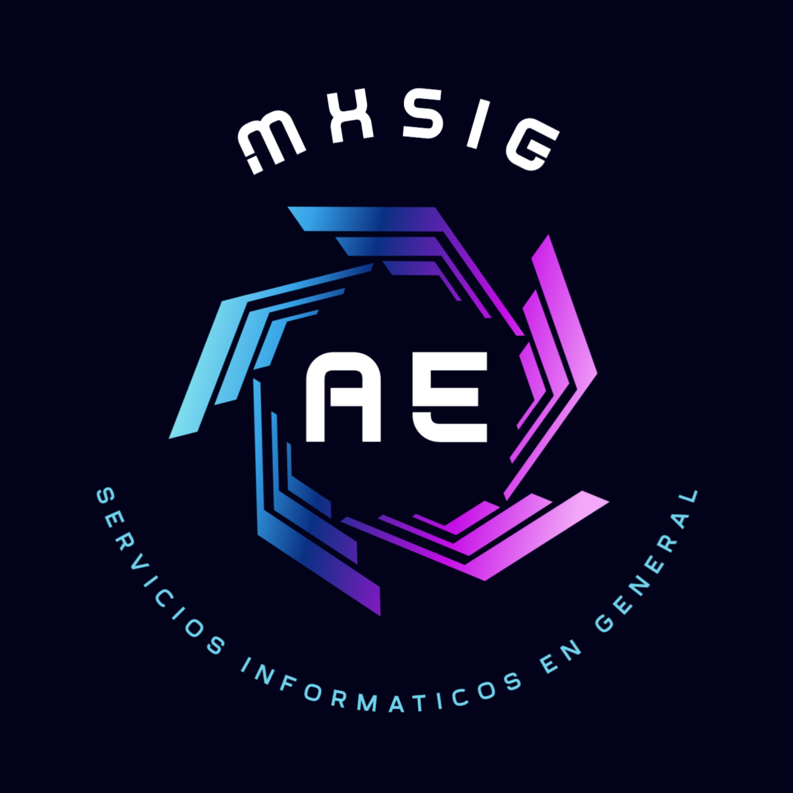

# WORD TO PDF

Sistema donde se sube un archivo en word y se le agrea un fondo con el membrete de la empresa ajustando los margenes para un correcto ajuste visual, se guarda el original y se genera otro word con el membrete y se exporta a PDF, el sistema guarda en una mase de datos de MySQL las rutas y los nombres de los archivos para su descarga y almacenaje.

## 🚀 Hola, mi nombre es
I'm Antonio Espiritu...
Soy desarrollador FullStack hace más de 10 años principalmente con PHP, JavaScript y MySQL, hace 5 años en proyectos en diferentes lenguajes como JAVA, NodeJS, Angular (proyectos de autoaprendizaje), Python, PostgreSQL, así también conecte bases de datos en Amazon AWS, tengo experiencia con servidores Linux, así como sus variantes de escritorio, uso de Mac OS y Windows.

## Authors

- [@aespiritu](https://www.mxsig.com)

